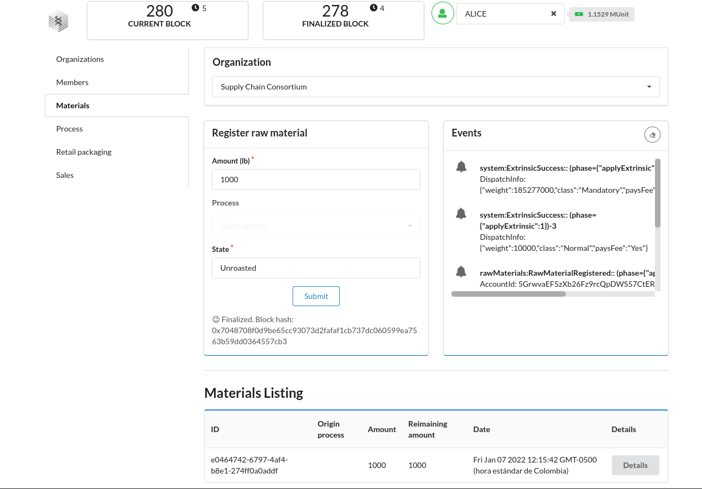
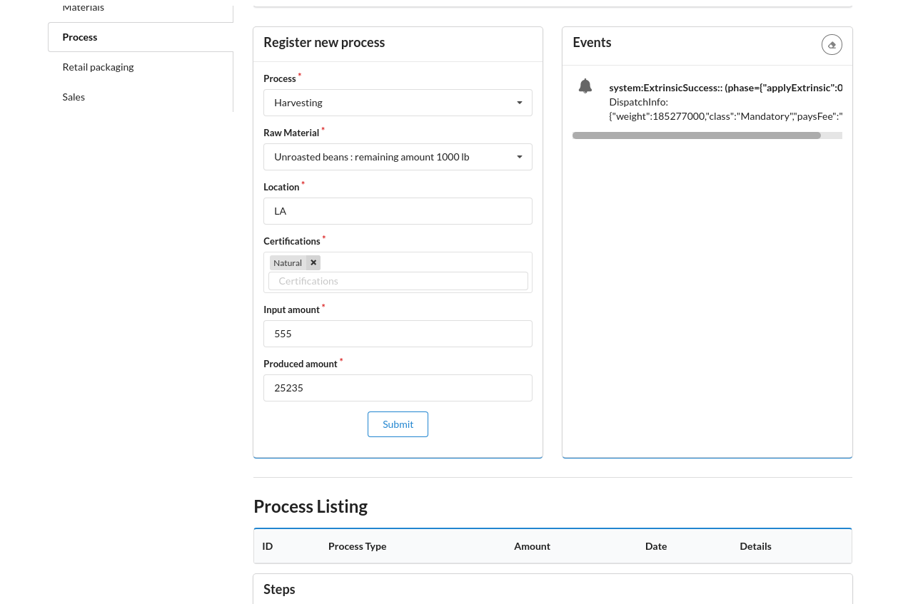

# Substrate & FRAME Supply Chain Sample

** Forked from https://github.com/IoTone/substrate-enterprise-sample-v3 **

## *Status:  *
 

This sample project demonstrates how the [Substrate](https://www.substrate.io/) framework for
building blockchains and its standard
[FRAME](https://substrate.dev/docs/en/knowledgebase/runtime/frame) library for runtime development
can be used to quickly build an ergonomic, end-to-end, blockchain-based application. This sample
includes a custom front-end that was created from the helpful
[Substrate Front-End Template](https://github.com/substrate-developer-hub/substrate-front-end-template),
which itself makes use of the powerful [Polkadot{JS}](https://polkadot.js.org/) API. The
[chain](chain) in this sample is a fork of the official
[Substrate Node Template](https://github.com/substrate-developer-hub/substrate-node-template) - a
supported starting point that decreases the time it takes to implement a custom next-generation
blockchain.

The use case that this sample demonstrates is a decentralized supply-chain consortium. In order to
accomplish this, FRAME is used to implement custom business logic as well as existing standards,
such as [decentralized identifiers (DIDs)](https://w3c.github.io/did-core/).

The capabilities demonstrated by this project include:

- Fine-grained and performance-preserving role-based access control (RBAC).
- Set-up and coordinate a decentralized network (permissioned blockchain) among several
  organisations.
- Manage decentralized identities for member organisations and their delegates.
- Register products and associated metadata, such as the organisation that owns them.
- Create shipments and track their journey through the supply chain.
- Monitor a shipment's storage and transportation conditions.

The sample demonstrates many features and capabilities of the
[Substrate framework](https://substrate.dev/), including:

- Consortium network with a
  [proof-of-authority consensus](https://en.wikipedia.org/wiki/Proof_of_authority)
  ([Aura](https://substrate.dev/docs/en/knowledgebase/advanced/consensus#aura) for block production,
  [GRANDPA](https://substrate.dev/docs/en/knowledgebase/advanced/consensus#grandpa) for block
  finalization). Substrate and FRAME ship with a number of well-research and battle-tested
  [consensus mechanisms](https://substrate.dev/docs/en/knowledgebase/advanced/consensus#consensus-in-substrate)
  and also make it possible to design and implement custom consensus mechanisms.
- Dynamic set of
  [authority](https://substrate.dev/docs/en/knowledgebase/getting-started/glossary#authority) nodes.
- Role-based access control (RBAC) built on
  [signed extensions](https://substrate.dev/docs/en/knowledgebase/learn-substrate/extrinsics#signed-extension).
- Reliable real-world data integration with
  [off-chain workers](https://substrate.dev/docs/en/knowledgebase/runtime/off-chain-workers).
- Flexible blockchain runtime development that uses FRAME pallets to encapsulate domain-specific
  logic (e.g. separate pallets for product [registry](chain/pallets/registrar) &
  [tracking](https://github.com/stiiifff/pallet-product-tracking)).
  
  
## Run
The provided cargo run command will launch a temporary node and its state will be discarded after you terminate the process. After the project has been built, there are other ways to launch the node.

Single-Node Development Chain
This command will start the single-node development chain with non-persistent state:

./target/release/node-template --dev
Purge the development chain's state:

./target/release/node-template purge-chain --dev
Start the development chain with detailed logging:

RUST_BACKTRACE=1 ./target/release/node-template -ldebug --dev
Development chain means that the state of our chain will be in a tmp folder while the nodes are running. Also, alice account will be authority and sudo account as declared in the [genesis state](https://github.com/substrate-developer-hub/substrate-node-template/blob/main/node/src/ chain_spec.rs#L49). At the same time the following accounts will be prefunded:

Alice
Bob
Alice//stash
Bob//stash
In case of being interested in maintaining the chain' state between runs a base path must be added so the db can be stored in the provided folder instead of a temporal one. We could use this folder to store different chain databases, as a different folder will be created per different chain that is ran. The following commands shows how to use a newly created folder as our db base path.

 ```bash
// Create a folder to use as the db base path
$ mkdir my-chain-state

// Use of that folder to store the chain state
$ ./target/release/node-template --dev --base-path ./my-chain-state/

// Check the folder structure created inside the base path after running the chain
$ ls ./my-chain-state
chains
$ ls ./my-chain-state/chains/
dev
$ ls ./my-chain-state/chains/dev
db keystore network
 ```
## Running the Demo

Follow the [installation instructions](https://substrate.dev/docs/en/knowledgebase/getting-started 

This demo also uses [Node.js](https://nodejs.org/en/) and [Yarn](https://classic.yarnpkg.com/en/),
so ensure that those dependencies are installed before continuing.

- Run the [Substrate chain](chain)

  ```bash
  cd chain
  cargo build --release
  # Launch the node in development mode and do not persist chain state
  ./target/release/enterprise-sample --dev --tmp
  ```
OR

  ```bash
  cd chain
  # Launch the node in development mode and do not persist chain state
    cargo run -- --dev --tmp
   ```
 (if you want to use the node from external mode use the command ```bash cargo run -- --dev --tmp --ws--external   ``` or ```bash ./target/release/enterprise-sample --dev --tmp --ws--external   ```  you can find more info here [https://github.com/substrate-developer-hub/substrate-node-template]) 
 
- Launch the [front-end](ui)

  ```bash
  cd ui
  yarn install && yarn start

## Run multiple nodes
please read the official documentation of substrate (https://docs.substrate.io/tutorials/v3/private-network/)  
 

## Guided Demo

This guided demo will walk through a simplified version of the steps performed by the
[initialization script](./scripts/src/init.js). The demo makes use of a number of
[well-known development accounts](https://substrate.dev/docs/en/knowledgebase/integrate/subkey#well-known-keys).
In order to understand the demo's steps, it's necessary to understand the runtime modules (pallets)
that inform the supply chain application and how they relate to each other.

### Project Components

The supply chain consortium application is comprised of a number of a modules, many of which are
configured in the [chain specification](chain/node/src/chain_spec.rs)'s `development_config`
function:

- [Role-Based Access Control (RBAC) pallet](https://github.com/gautamdhameja/substrate-rbac/tree/enterprise-sample) -
  This pallet maintains an on-chain registry of roles and the users to which those roles are
  assigned. A `Role` is a tuple that encapsulates the name of a pallet and a `Permission` that
  qualifies the level of access granted by the `Role`. A `Permission` is an enum with the following
  variants: `Execute` and `Manage`. The `Execute` permission allows a user to invoke a pallet's
  [dispatchable functions](https://substrate.dev/docs/en/knowledgebase/getting-started/glossary#dispatch).
  The `Manage` permission allows a user to assign and revoke roles for a pallet, and also implies
  the `Execute` permission. Access control validation is done at the
  [transaction pool](https://substrate.dev/docs/en/knowledgebase/learn-substrate/tx-pool) validation
  layer by way of the RBAC pallet's `Authorize`
  [signed extension](https://substrate.dev/docs/en/knowledgebase/learn-substrate/extrinsics#signed-extension).
  Notice the permissions that are configured in the chain specification file. Alice is granted the
  `Execute` permission on the RBAC pallet, which allows her to use the RBAC pallet to create roles.
  In order to enable her to bootstrap the consortium, Alice is also granted the `Manage` permission
  on a few other pallet.
- [Registrar pallet](chain/pallets/registrar/src/lib.rs) - The Registrar pallet inherits
  decentralized identifier (DID) capabilities from the
  [DID pallet](https://github.com/substrate-developer-hub/pallet-did) and uses these capabilities to
  implement an organization registry. This pallet maintains a list of organizations and maps each
  organization to a list of members. Organizations are identified by the ID of the account that
  created and owns it, which means that an account may create and own _at most_ one organization.
  Organizations are associated with a name, which is designated by the value of the `Org` attribute
  on the DID of the organization owner. Organization owners are the only accounts that may add
  members to their organizations. When an account is added to an organization as a member, the
  organization owner creates an `OrgMember` delegate for the member's DID - this is a way for the
  organization owner to certify an account's membership in the organization. The registrar pallet
  exposes a custom [origin](https://substrate.dev/docs/en/knowledgebase/runtime/origin),
  `EnsureOrg`, that validates whether or not an account owns or is a member of at least one
  organization. The `EnsureOrg` origin is used to control access to many of the chain's
  capabilities, including the ability to create roles with the RBAC pallet.
- [Raw materials pallet](chain/pallets/raw-materials/src/lib.rs) - This pallet maintains a
  registry of raw materials and maps each material to the organization to which it belongs. A raw material is
  defined by six required properties (an ID, an origin process, a time of creation, state, amount and remaining amount) 
- [supply Chain  pallet](chain/pallets/supply-chain/src/lib.rs) - The Supply chain pallet save and handle all the process from the beans to sale coffee products, going through Harvesting, Processing, Packaging, Transporting, Roasting, Grinding

- [Retail transaction pallet](chain/pallets/retail-transactin/src/lib.rs) - saves and handles the retail packaging creating a sku for the products, amont of produtcs, etc. also handles the retail sales
   
- [coffee products pallet](chain/pallets/coffee-products/src/lib.rs) - saves and handles the coffee products, amount created, remaining amount, date of creation, lb, price, kind of product(grinded, roasted,etc )

 

### Demo Steps

1. Navigate to the locally deployed instance of the demo UI, which should be running at
   http://localhost:8000/demo. Notice that the UI has an account selector that default to the Alice
   account. This is important due to the special permissions that were configured for Alice in the
   chain specification file.

   

1. Use the Members tab to create the Execute permission for three pallets: `registrar`,
   `productRegistry`, and `productTracking`.

   

1. Assign the three newly created roles to Bob, whose address is
   5FHneW46xGXgs5mUiveU4sbTyGBzmstUspZC92UhjJM694ty. This will allow Bob to create an organization,
   products, shipments, and shipment events.

   

   Note: use this link to navigate to the Polkadot{JS} Apps UI and configure it to connect to the
   local supply chain network:
   [https://polkadot.js.org/apps/#/explorer?rpc=ws://127.0.0.1:9944](https://polkadot.js.org/apps/#/explorer?rpc=ws://127.0.0.1:9944).
   Use the block hash provided by the supply chain UI to inspect the block that contained a
   transaction.

   

1. Use the account selector to switch to Bob's account, and then go back to the Organizations tab to
   create an organization.

   

1. Navigate to the Raw material tab and create raw material.

   

1. Use the Process tab to create register a new process whit the raw material that were created in the
   previous step, the input amount is how much of the raw material you want to use, and the produced is the material created for in process (then you can use that produced amount to retail packaging or to create a new raw material for another process)

   

1. Navigate to the raw material tab and use the previous step created, this will create a new raw material for another step  

   
   
1. Navigate to the Process tab and you will can continue with another process with the input of the previously raw material
   
   
   
 1. Navigate to the retail Packaging tab when you want to create the products for sale, you will have to select the process where the material comes from, and the amount of product that you want to create, as well you will have to introduce a unique SKU and all the others requeriodes fields
   
   
 1. And if you go to sale tab, you can create a new sale, where you will select the sku of the product to sale, the amount of product and the buyer
    
  
  ## IN EVERY STEP YOU CAN TRACK ALL THE MATERIALS, PROCESS, PACKAGINGS AND SALES 

## Related Github Repositories

- [Validator Set Pallet](https://github.com/gautamdhameja/substrate-validator-set)

## Disclaimer

This project is intended for demonstration purposes and is not audited or ready for production use and was based on (https://github.com/IoTone/substrate-enterprise-sample-v3)

also some of the documentation is based in the node template example' readme  of substrate(https://github.com/substrate-developer-hub/substrate-node-template#readme)
